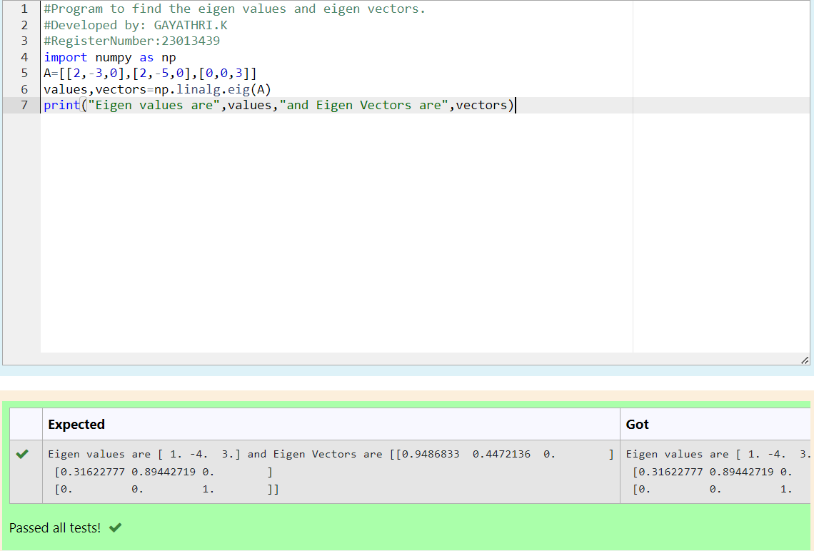

# EIGENVALUES-AND-EIGENVECTORS
## Aim:
To write a python program to find the Eigenvalues and Eigen Vectors
## Equipment’s required:
1. 	Hardware – PCs
2. 	Anaconda – Python 3.7 Installation / Moodle-Code Runner
## Algorithm:
### Step1 : 
import numpy as np
   
   The first line imports the NumPy library and gives it the alias np for brevity in the code.


### Step 2: 
A = [[2, -3, 0], [2, -5, 0], [0, 0, 3]]
   
   Here, a list A is defined to represent the matrix for which you want to find the eigenvalues and eigenvectors.

 
### Step 3:
 Using the np.linalg.eig(),  we get two results (first is eigenvalue and second is eigenvector) of the given matrix.
### Step 4:
At last print("Eigen values are", values, "and Eigen Vectors are", vectors)

## Program:
``````
#Program to find the eigen values and eigen vectors.
#Developed by: GAYATHRI.K
#RegisterNumber:23013439
import numpy as np
A=[[2,-3,0],[2,-5,0],[0,0,3]]
values,vectors=np.linalg.eig(A)
print("Eigen values are",values,"and Eigen Vectors are",vectors)
``````
## Output:

## Result:
Thus the Eigenvalue and Eigenvector is successfully solved using python program
